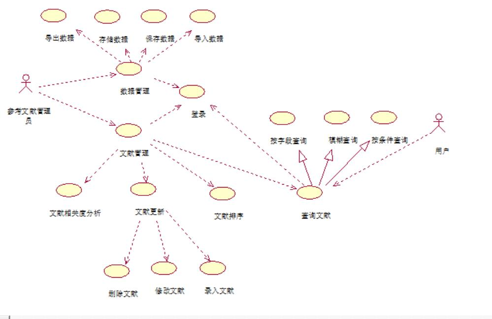

# 参考文献管理系统

> Literature Management System

## 项目定位

管理一组文献记录，提供多种操作功能，具有友好用户界面

## 需求分析

基本功能

1. 存储、保存文献数据
2. 增删改查 （录入、删除、修改、查询）
3. 按字段查询 （作者、篇名、类型、出版机构、出版时间等）

高级功能

1. 导入、导出数据（多种方式）
2. 特殊查询（按条件、模糊）
3. 结果聚合（排序）
4. 文献相关度分析（高难度，可选）

额外字段

+ 文献.被引次数
+ 期刊.影响因子
+ 期刊.分区

## 用例分析

文献更新用例：文献管理员对文献的数据进行录入、修改和删除

数据管理用例：文献管理员对数据以多种方式进行存储和保存，导入导出

文献排序用例：对文献按时间顺序（或其他顺序）进行排序

查询文献用例：用户或管理员可以按多种查询方式（按字段、条件、模糊查询）进行相关查询，显示查询结果

文献相关度分析文献：管理员实现对文献相关度的分析，查询文献后会有窗口显示相关文献名可供查看

### 用例描述

文献更新用例描述

用例名称：文献更新

参与者：文献管理员

前置条件：管理员成功登陆文献管理系统

事件流：

录入

1. 单击“录入”按钮
2. 将新增文献信息录入到系统中

删除

1. 单击“删除按钮”
2. 选择所删除的文献
3. 单击“确定”按钮

修改

1. 单击“修改”按钮
2. 选择所修改的文献
3. 输入修改后的信息
4. 单击“确定”按钮

数据管理用例描述

用例名称：数据管理

参与者：文献管理员

前置条件：管理员成功登陆文献管理系统

事件流：

1. 选择方式将数据进行存储、保存
1. 在系统需要数据时，将数据进行导入和导出

文献排序用例描述

用例名称：文献排序

参与者：文献管理员

前置条件：管理员成功登陆文献管理系统

事件流：

1. 单击“排序”按钮
2. 选择排序方式
3. 完成对文献的相关排序

查询文献用例分析

用例名称：查询文献

参与者：文献管理员，用户

前置条件：管理员及用户成功登陆文献管理系统

事件流：
1. 单击“查询”按钮
2. 选择相关查询方式进行查询
3. 完成查询，显示查询信息

## 架构设计

MVC 模式（改）

视图层(View)

+ 数据管理
+ 文献管理
+ 文献查询
+ ...

控制层(Controller)

+ 文献管理控制器
+ 用户管理控制器

模型层(Model)

+ 文献 DAO
+ 用户 DAO
